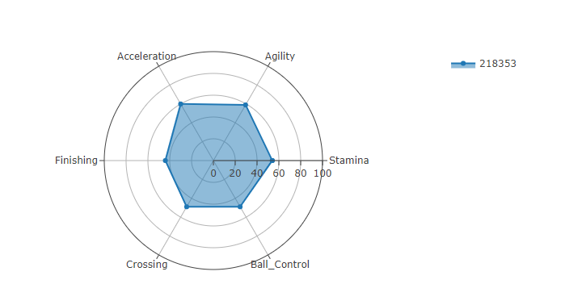
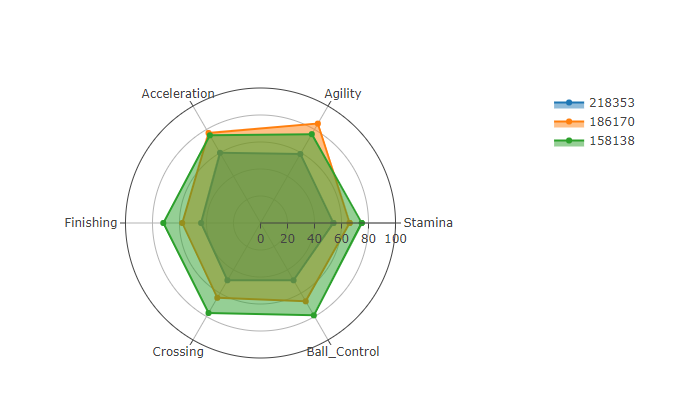

## Project Proposal

  Our team will comparing data from the international FIFA football game

  visualize player attributes to determine:
  
      1) which attributes contribute to higher competitiveness
      2) 
      3)
  
    
    
    
    
    
    
    
